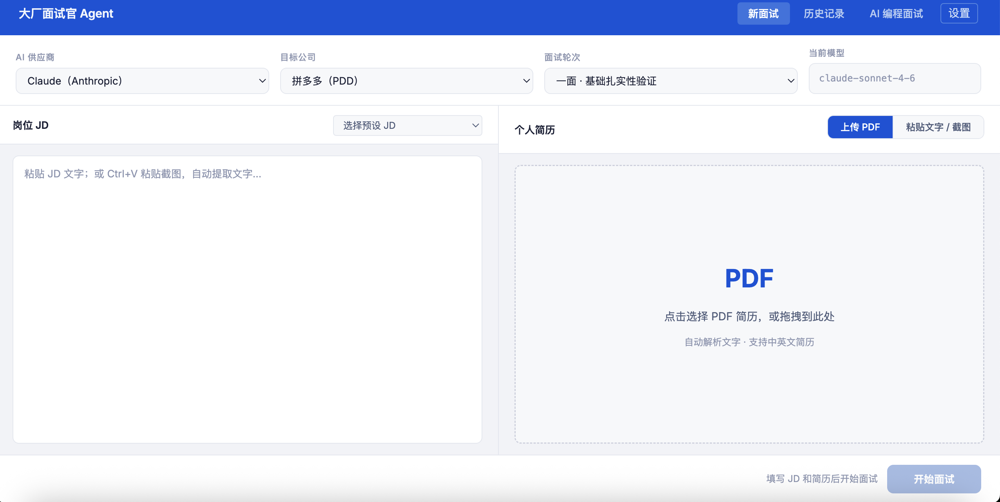
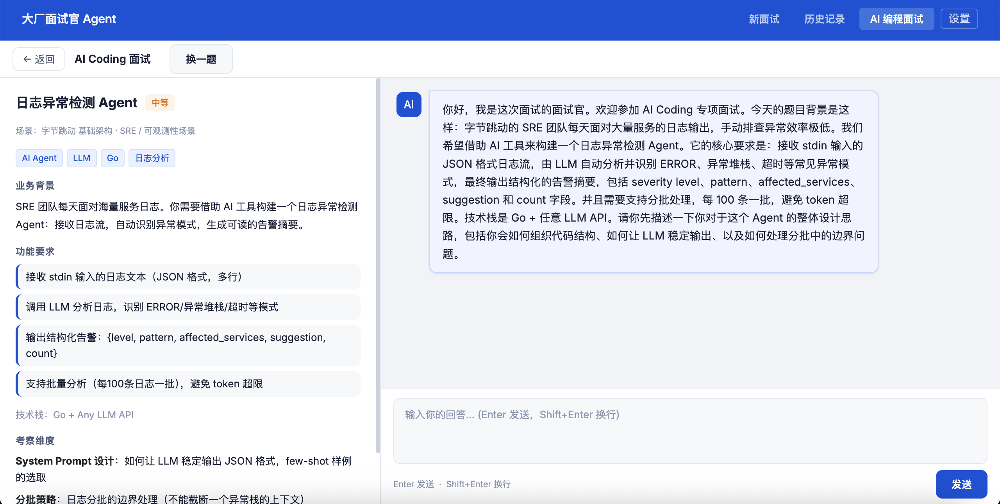

# 大厂面试官 Agent

用 AI 模拟真实大厂技术面试，支持字节跳动、腾讯、阿里巴巴等 8 家公司的面试风格，让你在家也能体验高压大厂面试。

## 界面预览

**面试配置页** — 上传简历、选择公司和面试轮次



**AI Coding 面试** — AI 面试官实时追问，考察 AI 工具使用能力



---

## 功能亮点

- **8 家大厂风格**：字节跳动、腾讯、阿里巴巴、美团、京东、快手、小红书、拼多多
- **三轮面试**：一面（基础）→ 二面（项目深挖）→ 三面（系统设计）
- **AI Coding 专项**：14 道真实场景题，对话式考察 AI 工具使用能力
- **智能简历解析**：上传 PDF 自动提取文字，或粘贴截图 OCR 识别
- **历史记录**：面试记录自动保存，随时回放

---

## 部署教程（新手向）

### 第一步：安装 Go 环境

1. 打开 [https://golang.org/dl/](https://golang.org/dl/)
2. 下载你系统对应的安装包（macOS 选 `.pkg`，Windows 选 `.msi`）
3. 安装完成后，打开终端（Mac 的「终端」或 Windows 的「命令提示符」），输入以下命令验证安装：

```bash
go version
```

看到类似 `go version go1.21.x` 表示安装成功。

### 第二步：下载项目

```bash
git clone https://github.com/chenyongzhi1119/interviewerAgent.git
cd interviewerAgent
```

> 没有 git？可以直接在 GitHub 页面点「Code → Download ZIP」下载解压。

### 第三步：获取 AI 供应商 API Key

项目支持多家 AI 供应商，**选择一家注册即可**，推荐新手使用 DeepSeek（国内可用、有免费额度）：

| 供应商 | 注册地址 | 是否免费 | 国内可用 |
|--------|---------|---------|---------|
| **DeepSeek（推荐）** | [platform.deepseek.com](https://platform.deepseek.com) | 有免费额度 | ✅ |
| 智谱 GLM | [open.bigmodel.cn](https://open.bigmodel.cn) | 有免费额度 | ✅ |
| 阿里 Qwen | [dashscope.aliyuncs.com](https://dashscope.aliyuncs.com) | 有免费额度 | ✅ |
| Claude | [console.anthropic.com](https://console.anthropic.com) | 需付费 | ❌（需代理） |
| GPT-4.1 | [platform.openai.com](https://platform.openai.com) | 需付费 | ❌（需代理） |

**DeepSeek 注册步骤（以此为例）：**
1. 打开 [platform.deepseek.com](https://platform.deepseek.com)
2. 手机号注册登录
3. 进入「API Keys」页面，点「创建 API Key」
4. 复制生成的 Key（以 `sk-` 开头）

### 第四步：启动项目

打开终端，进入项目目录，运行以下命令（把 `sk-xxxxxx` 替换为你的 Key）：

**macOS / Linux：**
```bash
export DEEPSEEK_API_KEY=sk-xxxxxx
go run main.go
```

**Windows（命令提示符）：**
```cmd
set DEEPSEEK_API_KEY=sk-xxxxxx
go run main.go
```

看到以下输出说明启动成功：
```
面试官 Agent 已启动 → http://localhost:8080
```

### 第五步：打开浏览器

在浏览器地址栏输入：

```
http://localhost:8080
```

即可开始使用！

---

## 使用方法

1. **选择配置**：选择 AI 供应商、目标公司（字节/腾讯/阿里等）、面试轮次
2. **填写 JD**：粘贴岗位描述文字，或直接 `Ctrl+V` 粘贴招聘截图（自动识别文字）
3. **上传简历**：点击上传 PDF，或切换到「粘贴文字」模式手动粘贴
4. **开始面试**：点击「开始面试」，AI 面试官主动提问
5. **用麦克风或键盘回答**：按 `Enter` 发送，`Shift+Enter` 换行
6. **获取评估**：点击「结束本轮 · 获取评估」，AI 给出详细点评和评级

> **不想每次输入环境变量？** 启动后在页面右上角「设置」里填入 API Key，浏览器自动保存，下次不需要重新填写。

---

## 打包为 Mac 应用（可选）

如果你用 Mac，可以把它打包成一个可以双击运行的应用：

```bash
# 打包
bash scripts/build_app.sh

# 首次使用清除隔离限制（只需执行一次）
xattr -dr com.apple.quarantine InterviewPro.app

# 双击打开（或运行以下命令）
open InterviewPro.app
```

打包好的 `InterviewPro.app` 会出现在项目目录里，可以拖到「应用程序」文件夹中使用。

---

## 项目结构

```
interviewerAgent/
├── main.go              # 程序入口
├── companies/           # 8 家公司的面试风格配置
├── internal/            # 核心逻辑（AI、解析、路由）
├── web/                 # 前端页面（自动嵌入程序中）
├── scripts/             # 构建脚本
└── sessions/            # 面试记录（本地保存，不上传）
```

## 扩展：添加更多公司

在 `companies/` 目录新建一个 `xxx.yaml` 文件，参考现有文件的格式编写，重启程序后自动加载，无需改代码。

---

## 常见问题

**Q：启动后浏览器打开是空白页？**
等待几秒重新刷新，首次启动需要初始化。

**Q：提示「No LLM provider configured」？**
需要设置至少一个 AI 供应商的 API Key，参考第三步。

**Q：Mac 双击 .app 提示无法打开？**
运行一次 `xattr -dr com.apple.quarantine InterviewPro.app` 解除系统限制。

**Q：如何退出 Mac 应用？**
点击菜单栏右上角的蓝色圆形图标，选择「退出 InterviewPro」。

---

## License

MIT License © 2025 [chenyongzhi1119](https://github.com/chenyongzhi1119)
